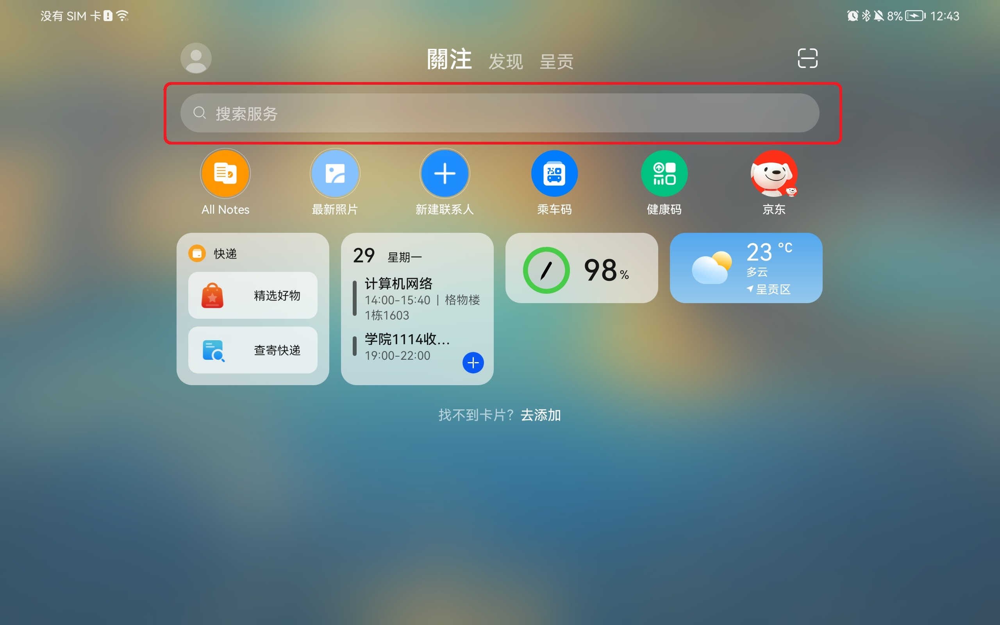
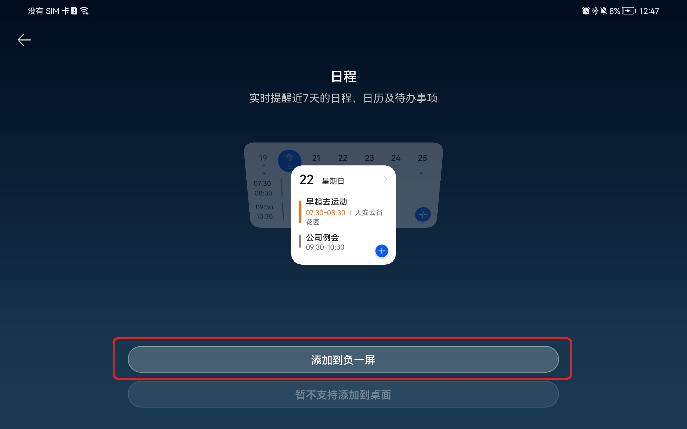
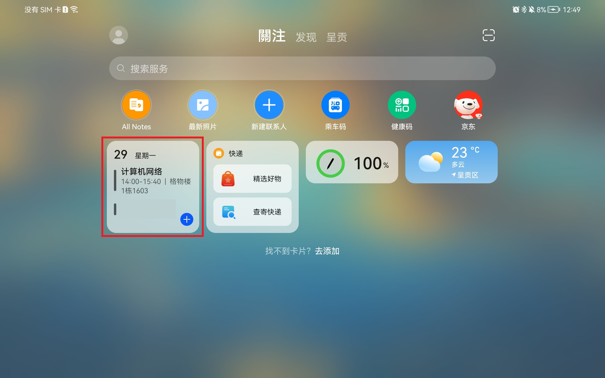
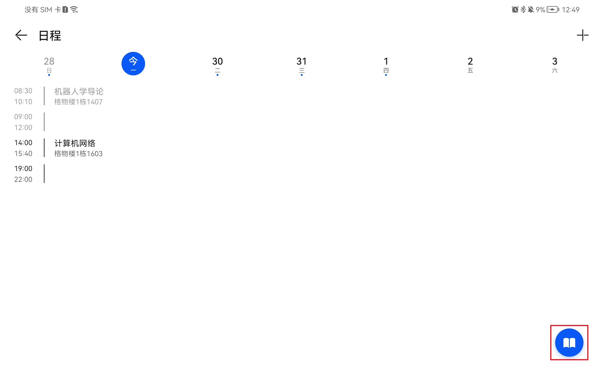
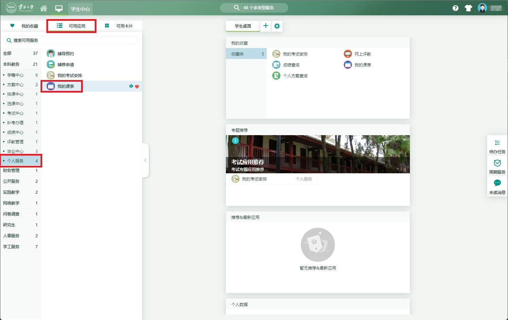
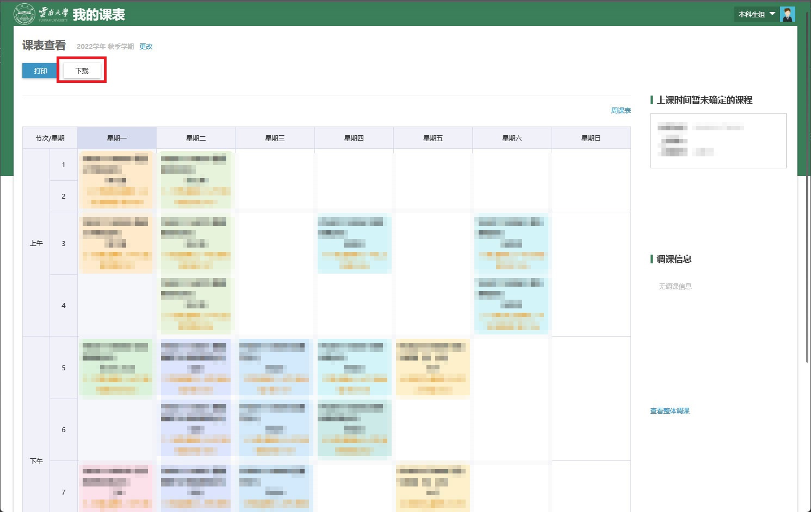
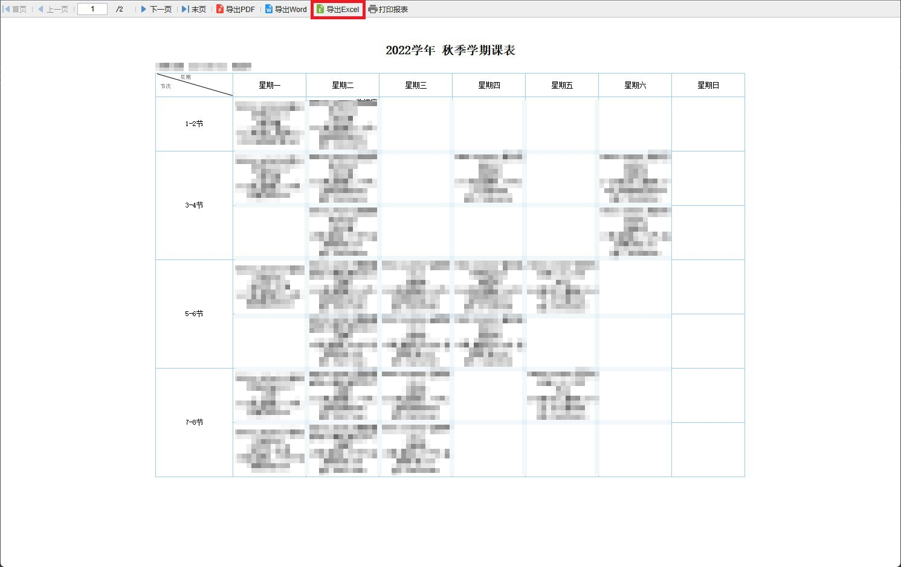
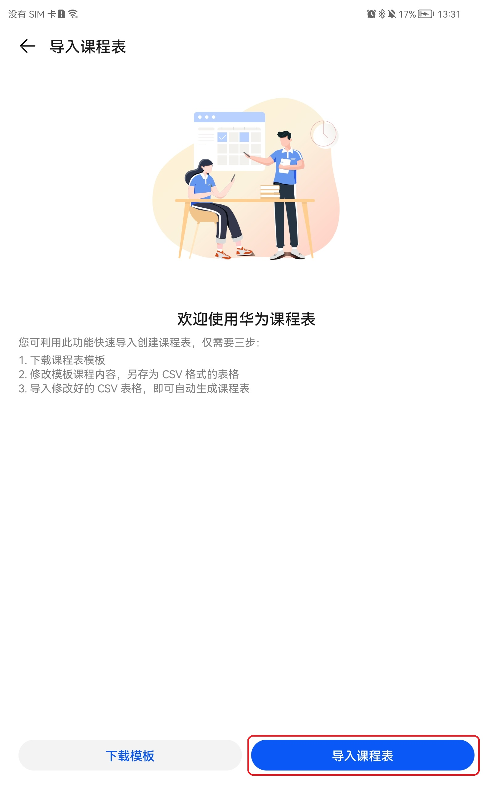
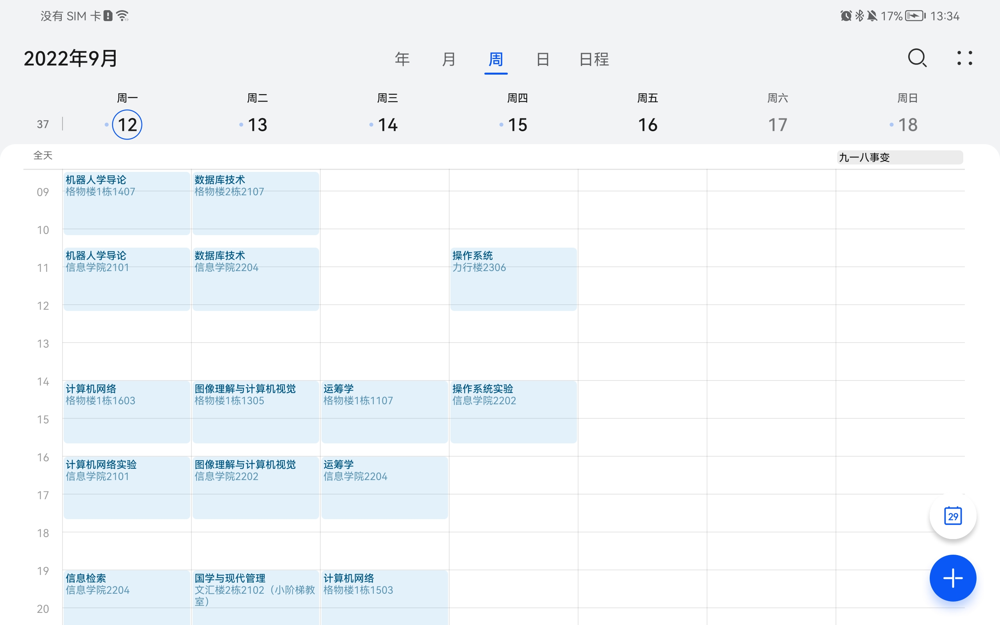

# 这是一个用于转换YNU课表的脚本
## 支持的App(后续会逐渐适配更多同类App的)
* **华为课程表/HWCalender**
*(在HarmonyOS 2.0中，日程支持通过csv格式的文件导入课表)*

## 使用方法
### 使用前须知：由于发现部分设备不支持导入课程表到日程中，使用前请按以下步骤确认
* 在负一屏中找到“搜索服务”搜索框或一个加号的按钮，点击进入后搜索“日程”并将其添加到负一屏
* 
* 
* 随后通过负一屏的卡片进入日程，如果右下角有这个图标，则可以通过其导入课程表。
* 
* 
### 从官网下载课表文件（以Excel格式保存）
* 进入 [云南大学网上服务大厅](https://ehall.ynu.edu.cn/new/index.html)，并登录
* 在主页左侧找到“可用应用”-“本科教务”-“个人服务”的“我的课表”
* 
* 在确认当前课程表为本学期后，点击左上角的“下载”，在弹出窗口选择“导出为Excel”，即可完成保存
* 
* 
### 使用本脚本导出文件
* 已有任意Python 3的环境
* 安装**openpyxl**库：```pip install openpyxl```
* 运行**main.py**，按提示在命令行中输入所需内容，最后即可得到导出文件
* 将导出文件传到手机/平板中
### 如何使用导出的文件
#### 鸿蒙系统自带的日程
* 在负一屏中找到日程卡片，点击进入
* 
* 点击右下角的该图标
* 
* 点击右下角的“导入课程表”，找到传入的文件，稍等片刻即可
* 
* 效果如下图
* 